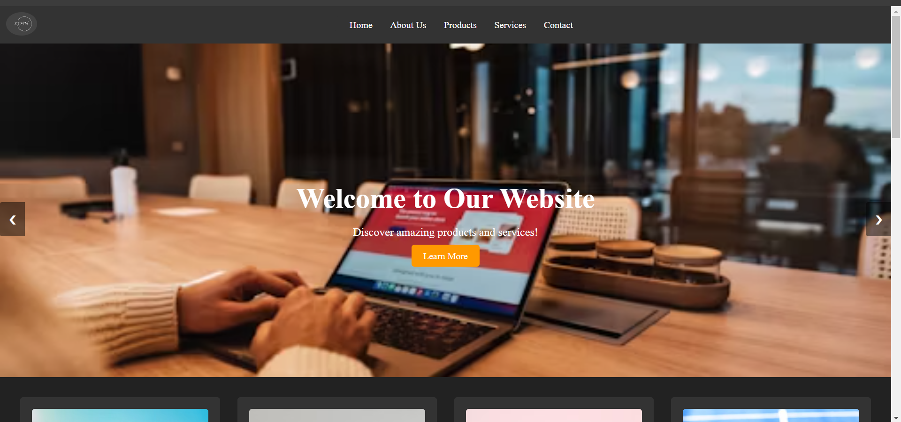

# Project Title

KORN-HUB

## Description

My personal ecommerce startup website

## Table of Contents

- [Snapshot](#snapshot)
- [Installation](#installation)
- [Usage](#usage)
- [Features](#features)
- [Technologies Used](#technologies-used)
- [Contributing](#contributing)
- [License](#license)

## Snapshot

## Installation

Please describe the steps required to install and run your project locally. Include any dependencies or prerequisites.

## Usage

Please provide instructions on how to use your eCommerce platform. This could include login details for testing accounts, key functionalities, and sample usage scenarios.

## Features

Please list the main features of your eCommerce project.

- Feature 1: 
- Feature 2: 
- Feature 3: 

## Technologies Used

Please list the technologies, frameworks, and languages used to build your project.

- Frontend: 
- Backend: 
- Database: 
- Other tools/libraries/APIs used: 

## Contributing

Please include guidelines for those who want to contribute to your project.

## Acknowledgements

Please mention any third-party resources, libraries, or inspirations used in your project.

## Contact

Feel free to contact me via [email](rexford.addo26@gmail.com) for any inquiries.

You can also connect with me through my [Linktree](https://linktr.ee/kotnemesis) to access my social media links.
